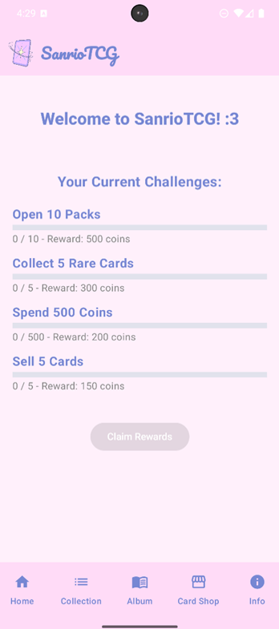
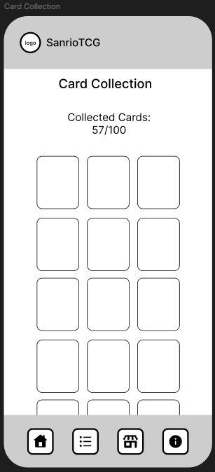
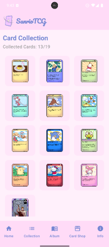
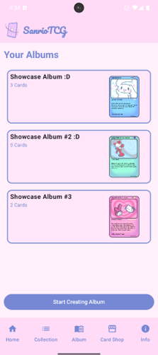
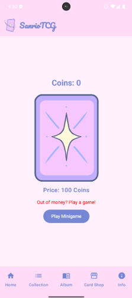
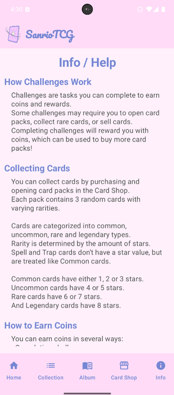

# SanrioTCG

## Brief Description
Sanrio Card Collector is a delightful mobile app where users can collect, organize, and showcase digital cards featuring beloved Sanrio characters. Users can complete challenges to earn new cards and design personalized digital albums to share their unique collections.

---

## Team Members
- **Thomas Stopper, cc231012**  
- **Leonie Kozak, cc231010**

---

## APK Download link
[Download the APK](https://drive.google.com/file/d/1aIguUMWKKPL5fi-Qcd4gridhnzYtQptB/view?usp=sharing)

---

## Main Screens and Features

### 1. Home Screen
- Displays all challenges and their progress.

### 2. Card Collection Screen
- Displays all collected cards in a grid view.
- Users can tap a card to view its details (e.g., description, rarity).
- Users can sell cards in order to gain coins.

### 3. Albums Screen
- Users can create, read, update & delete their personalized albums.

### 4. Card Shop Screen
- Users can buy and open card packs using earned coins.

### 5. Info / Help Screen
- Users can look up drop chances & rarities of all cards and can access help (with detailed explanations of the app) and credits.

---

## User Flow

---

## Comparison Mockup vs. Final App

### 1. Home Screen

### 2. Card Collection Screen

### 3. Albums Screen

### 4. Card Shop Screen

### 5. Info / Help Screen

---

## App Concept

### Use Case
- **Problem Statement**:  
  Many Sanrio fans and digital card collectors face the challenge of organizing and managing their growing collections. There is a lack of a dedicated mobile app that combines the joy of collecting Sanrio-themed digital cards with the ability to personalize and share collections in a fun, casual, and stress-free environment.
  
- **Target User**:  
  - **Primary Audience**:  
    - Sanrio fans of all ages.  
    - Users who enjoy digital collecting and personalization (e.g., Trading Card Game (TCG) enthusiasts).
  - **Secondary Audience**:  
    - People looking for a casual, visually appealing, and stress-free app experience.
    - Users interested in digital albums and interactive content based on popular Sanrio characters.

- **Solution**:  
  - **Sanrio Card Collector** is a mobile app that provides a delightful experience for users to collect, organize, and showcase digital cards featuring their favorite Sanrio characters. The app allows users to:
    - Collect new cards by completing challenges.
    - Organize their cards into personalized digital albums.
    - Sell cards to gain coins and purchase new card packs.
    - Share their collections with others in a casual, fun environment.

- **Similar Applications**:
  - **Panini Digital Sticker Album**: Allows users to collect digital stickers and trade them with friends. However, it lacks personalization features and doesn’t focus on a specific theme like Sanrio.
  - **Topps Digital Card Trader**: A digital trading card app that allows users to collect and trade sports and entertainment-themed cards. While it provides similar functionality, it does not focus on the cute and thematic appeal of Sanrio characters.
  
- **Difference from Similar Apps**:
  - Unlike existing digital card collection apps, **Sanrio Card Collector** focuses exclusively on Sanrio characters, offering a unique and thematic experience.
  - The app emphasizes **personalization** with the ability to create and share custom digital albums, setting it apart from more generic collection apps.
  - The **casual, non-competitive nature** of the app provides a stress-free experience, which differentiates it from other apps that may focus more on trading or competition.

---

## Test Design/Protocol

### Experimental Questions & Hypotheses

#### Experimental Question 1:
Does being able to sort cards into self-made Albums help Users keep track of their favourite cards?

- **Hypothesis 1**:  
  Being able to sort cards into self-made Albums helps Users keep track of their favourite cards.  
  **IV**: Self-made Albums  
  **DV**: Keep track of favourite cards

#### Experimental Question 2:
Does being able to play the minigame prevent Users from having to sell their favourite cards?

- **Hypothesis 2**:  
  Being able to play the minigame prevents Users from having to sell their favourite cards.  
  **IV**: Being able to play the minigame  
  **DV**: Prevent Users from having to sell their favourite cards

#### Experimental Question 3:
Does opening card packs with nice looking Art provide a relaxing break from day-to-day activities for Users?

- **Hypothesis 3**:  
  Opening card packs with nice looking Art provides a relaxing break from day-to-day activities for Users.  
  **IV**: Opening card packs with nice looking Art  
  **DV**: A relaxing break from day-to-day activities

#### Experimental Question 4:
Does completing the challenges encourage Users to use the app more frequently?

- **Hypothesis 4**:  
  Completing the challenges encourages Users to use the app more frequently.  
  **IV**: Completing the challenges  
  **DV**: Encourage Users to use the app more frequently

---

## User Tests

### Demographics

- **Age Range**: 19-57
- **Participants**: 5
- **Countries**: 4x Austria, 1x Portugal

### Results
- All Users could find and open a card pack.
- The card opening mechanism was intuitive to all Users.
- 60% of the Users were Very Satisfied, 40% Satisfied with the card opening mechanism.
- All Users found out how to sell cards and deemed the functionality very useful.
- 4 out of 5 participants found the Minigame.
- All participants who played the Minigame were satisfied.
- When asked why Participants viewed the Minigame as intuitive, they gave the following answers:   
*"very obvious"*  
*"Self explanatory - you click on coins to get coins. Keeps you occupied."*  
*"easy to understand"*  
*"I can't find the minigame"*  
- All participants were able to fulfil all tasks related to Albums.
- When asked how satisfied Users were with the Albums, their answers differed:  
40% - very satisfied  
20% - satisfied  
20% - neutral  
20% - dissatisfied
- All Participants found and completed the Challenges. They were all very satisfied with them overall, and deemed them to be very intuitive.
- When asked why they like the challenges, they gave the following answers:  
*"i like the extra coins :D"*  
*"Fun little goals you strive to complete, and they are not hard at all."*
- Most participants reviewed SanrioTCG to be relaxing to play. When asked why they gave the following answers:  
*"it was very nice to play"*  
*"Everything was very easy to do and easy to understand, and I had fun with the minigames and challenges."*  
*"was very satisfying"*
- 60% of the participants would be interested in actually playing a TCG game with cute themed cards.
- When asked for any additional feedback, participants answered:  
*"Personally, I think this game is very well made and was fun to play!"*  
*"I haven't found any problems using the app, it works very well, although I've never run out of money. Congratulations, the app is exceptional, very good, with lots of features."*  
*"function is very good and the design/art on the cards amazing"*

---

## Final Reflection

### Thomas Stopper: *(Backend)*
**Contribution**:
- Main Functionality of app
- Database Integration
- Tested 2 People

**Challenges**:
- Dependencies
- Small Problems with Database
  
### Leonie Kozak: *(Frontend)*
**Contribution**
- Creation of ALL Cards
- Designed App UI via Jetpack Compose
- Google Forms Creation
- Tested 2 People

**Challenges**:
- Jetpack Compose
- Not a challenge, but very time consuming: picking a good color scheme that fits the app.

### **Further Improvements**: *(if development continued even after the CCL)*
- even more cards
- extra packs with different card sets
- more ways to earn coins (e.g. more challenges)

  But for the CCL we can say that the final app meets the criteria we set ourselves in the initial concept! :D
  
---

## Tools
- **Mockup Tools**: Figma for wireframes and PowerPoint for presentation
- **User Flow**: Figma
- **User Testing**: Word & Google Forms
- **Card Art**: IbisPaintX
- **Code**: Android Studio
