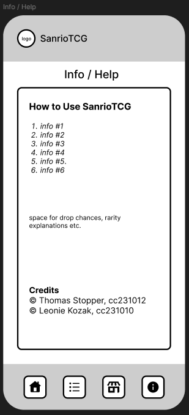

# SanrioTCG

## Brief Description
Sanrio Card Collector is a delightful mobile app where users can collect, organize, and showcase digital cards featuring beloved Sanrio characters. Users can complete challenges to earn new cards and design personalized digital albums to share their unique collections.

---

## App Concept

### Use Case
- **Problem Statement**:  
  Many Sanrio fans and digital card collectors face the challenge of organizing and managing their growing collections. There is a lack of a dedicated mobile app that combines the joy of collecting Sanrio-themed digital cards with the ability to personalize and share collections in a fun, casual, and stress-free environment.
  
- **Target User**:  
  - **Primary Audience**:  
    - Sanrio fans of all ages.  
    - Users who enjoy digital collecting and personalization (e.g., Trading Card Game (TCG) enthusiasts).
  - **Secondary Audience**:  
    - People looking for a casual, visually appealing, and stress-free app experience.
    - Users interested in digital albums and interactive content based on popular Sanrio characters.

- **Solution**:  
  - **Sanrio Card Collector** is a mobile app that provides a delightful experience for users to collect, organize, and showcase digital cards featuring their favorite Sanrio characters. The app allows users to:
    - Collect new cards by completing challenges.
    - Organize their cards into personalized digital albums.
    - Sell cards to gain coins and purchase new card packs.
    - Share their collections with others in a casual, fun environment.

- **Key Features**:
  - **Home Screen**: Displays challenges and a summary of the user’s collection progress.
  - **Card Collection Screen**: Shows all collected cards in a grid view. Users can tap a card to view its details (e.g., description, rarity). Users can also sell cards to gain coins.
  - **Albums Screen**: View, edit, and delete personalized albums.
  - **Card Shop Screen**: Users can purchase card packs using earned coins.
  - **Info / Help Screen**: Provides drop chances and rarities for all cards, along with detailed app explanations and credits.

- **Similar Applications**:
  - **Panini Digital Sticker Album**: Allows users to collect digital stickers and trade them with friends. However, it lacks personalization features and doesn’t focus on a specific theme like Sanrio.
  - **Topps Digital Card Trader**: A digital trading card app that allows users to collect and trade sports and entertainment-themed cards. While it provides similar functionality, it does not focus on the cute and thematic appeal of Sanrio characters.
  
- **Difference from Similar Apps**:
  - Unlike existing digital card collection apps, **Sanrio Card Collector** focuses exclusively on Sanrio characters, offering a unique and thematic experience.
  - The app emphasizes **personalization** with the ability to create and share custom digital albums, setting it apart from more generic collection apps.
  - The **casual, non-competitive nature** of the app provides a stress-free experience, which differentiates it from other apps that may focus more on trading or competition.

---

## Main Screens and Features

### 1. Home Screen
- Displays challenges and a summary of the user’s collection progress.

### 2. Card Collection Screen
- Displays all collected cards in a grid view.
- Users can tap a card to view its details (e.g., description, rarity). Note: works only on owned cards.
- Users can sell cards in order to gain coins.

### 3. Albums Screen
- Users can view, edit and delete their personalized albums.

### 4. Card Shop Screen
- Users can select and open card packs using earned coins.

### 5. Info / Help Screen
- Users can look up drop chances & rarities of all cards and can access help (with detailed explanations of the app) and credits.

---

## User Flow

---

## Mockups

### 1. Home Screen

### 2. Card Collection Screen

### 3. Albums Screen

### 4. Card Shop Screen

### 4. Info / Help Screen

---

## Tools
- **Mockup Tools**: Figma for wireframes and PowerPoint for presentation.
- **User Flow**: Figma.
